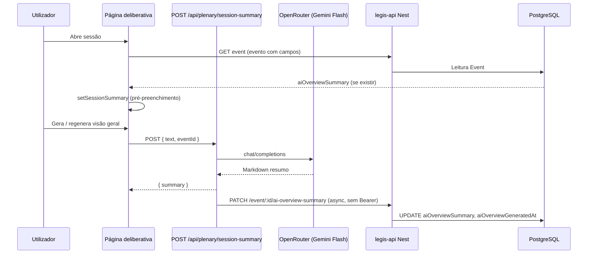

# Alterações: Visão geral da sessão (IA) — legis-api + legisai-v2

Documento de referência das mudanças relacionadas com **persistência do resumo analítico gerado por IA**, **novo contrato de prompt/relatório**, **UI do relatório e do cabeçalho da sessão deliberativa**, e **renderização estruturada da transcrição**.

---

## 1. Resumo executivo

| Área | O que mudou |
|------|-------------|
| **Base de dados** | Novos campos no modelo `Event` para guardar o texto do resumo e a data de geração. |
| **API REST** | Novo endpoint `PATCH` público para gravar o resumo após geração. |
| **Next.js (`session-summary`)** | Prompt do sistema redesenhado (mais seções analíticas); após gerar, envia o resumo para o backend quando `eventId` é enviado; mensagens de erro ligeiramente ajustadas. |
| **Página deliberativa** | Carrega resumo persistido ao abrir o evento; envia `eventId` na geração; pré-processamento de texto antes de partir em parágrafos; substituição de `<p>` genéricos por `SessionParagraph`; hero/cabeçalho e métricas repensados; botão de regeneração com condição temporária. |
| **SessionSummaryReport** | De acordeão para **tabs** (“Panorama factual” / “Leitura analítica”), **cards** com ícones, parsing de `###` por regex multilinha, stripping de emoji nos títulos, suporte a tabelas GFM no Markdown. |
| **SessionParagraph (novo)** | Componente dedicado com classificação de parágrafos (orador, cabeçalhos de secção, timestamps, timeline colapsável, etc.). |

---

## 2. Repositório `legis-api`

### 2.1 Prisma — `prisma/schema.prisma`

No modelo `Event` foram adicionados (e alinhados visualmente com os campos existentes `breves*`):

- `aiOverviewSummary` — `String?` — texto Markdown do relatório “Visão geral”.
- `aiOverviewGeneratedAt` — `DateTime?` — momento em que o resumo foi guardado/atualizado.

Os campos `brevesSummary` e `brevesProcessedAt` mantêm-se; apenas houve reindentação/Alinhamento na mesma área do schema.

### 2.2 Migração — `prisma/migrations/20260322130509_add_ai_overview_summary/migration.sql`

```sql
ALTER TABLE "events" ADD COLUMN "aiOverviewGeneratedAt" TIMESTAMP(3),
ADD COLUMN "aiOverviewSummary" TEXT;
```

### 2.3 Controller — `src/modules/event/controllers/event.controller.ts`

- Imports: inclusão de `Body` e `Patch` a partir de `@nestjs/common`.
- Novo método de rota:
  - **Método HTTP:** `PATCH`
  - **Caminho:** `:id/ai-overview-summary`
  - **Decorador:** `@IsPublic()` (acesso sem autenticação típica da API, alinhado a outros endpoints públicos do controlador).
  - **Corpo:** `{ summary: string }`
  - **Delegação:** `eventService.saveAiOverviewSummary(id, body.summary)`

### 2.4 Service — `src/modules/event/services/event.service.ts`

Novo método `saveAiOverviewSummary(id: string, summary: string)`:

- Executa `prisma.event.update` no `id` indicado.
- Grava `aiOverviewSummary` e `aiOverviewGeneratedAt: new Date()`.
- `select` de retorno: `id`, `aiOverviewSummary`, `aiOverviewGeneratedAt`.

**Nota de integração:** O frontend chama este endpoint com `PATCH` para `${NEXT_PUBLIC_API_URL}/event/${eventId}/ai-overview-summary`. O `GET` do evento por ID, se devolver o objeto `Event` completo via Prisma, passa a incluir naturalmente os novos campos — o cliente em `legisai-v2` tipou `EventDetailsAPI` com `aiOverviewSummary` e `aiOverviewGeneratedAt`.

---

## 3. Repositório `legisai-v2`

### 3.1 Rota API — `src/app/api/plenary/session-summary/route.ts`

**Autenticação:** Mantém verificação com `getAuthToken(req)`; 401 se ausente.

**Limite de contexto:** `MAX_CHARS = 200_000` (comentário indica ordem de grandeza ~30k tokens para Gemini Flash).

**Modelo LLM:** `google/gemini-2.0-flash-001` via OpenRouter (`https://openrouter.ai/api/v1/chat/completions`), `temperature: 0.3`, `stream: false`.

**Prompt do sistema (`SYSTEM_PROMPT`):** Substituído por uma versão mais estruturada e alinhada ao parser do frontend:

- Instruções para usar **exatamente** os títulos em `###` com emojis indicados, **sem** títulos `###` extra.
- Secções principais:
  - Contexto e clima
  - Dinâmicas de poder
  - Discursos e posicionamentos
  - Pauta e resultados
  - **Dimensões da sessão** (conflito, efetividade deliberativa, fluidez, debate vs. entregas)
  - **Insights analíticos** (3–5 itens com título, tipo, interpretação, evidência)
  - **Síntese final**
- Regras de formatação: negrito para nomes/partidos/projetos; listas com `-`; texto padrão quando não há dados; cautelas analíticas (sem intenção psicológica, sem vitória/derrota sem evidência, etc.).

**Corpo da requisição POST:**

- Antes: `{ text }`
- Agora: `{ text, eventId? }`

**Pós-processamento após resposta do modelo:**

- Se `eventId` for string não vazia e `process.env.NEXT_PUBLIC_API_URL` estiver definido, é feito um `fetch` em **fire-and-forget** para:
  - `PATCH ${NEXT_PUBLIC_API_URL}/event/${eventId}/ai-overview-summary`
  - `body: JSON.stringify({ summary })`
- Erros no `fetch` são apenas logados (`console.error` com mensagem que referencia sobrecarga/erro).
- **Importante:** Este `PATCH` **não envia** o token de autenticação do utilizador; o endpoint está `@IsPublic()` no Nest para permitir esta gravação.

**Mensagens de erro:** Texto da chave API alterado de “Chave da API Open Router ausente” para “Chave da API ausente”.

---

### 3.2 Componente novo — `SessionParagraph.tsx`

Ficheiro novo (~366 linhas), cliente (`"use client"`).

**Exportações:**

1. **`preprocessSessionText(rawText: string)`**  
   Normaliza o texto bruto da sessão:
   - Separa preâmbulo antes de `"(Texto com redação final)"` se existir.
   - Insere quebras em torno de marcadores e cabeçalhos conhecidos (`SECTION_HEADERS`: ABERTURA DA SESSÃO, ORDEM DO DIA, etc.).
   - Quebras antes de padrões de orador `(O SR.|A SRA. ...)` e “Tem a palavra”, timestamps `HH:MM RF`, etc.
   - Reanexa o preâmbulo no início.

2. **`SessionParagraph`** — recebe `text`, `searchTerm?`, `readingMode?`, `isHighlighted?`, `animationDelay?`.

**Classificação (`classifyParagraph`):** Tipos incluem `section_header`, `sub_header`, `speaker`, `moderator_note`, `timestamp`, `preamble_label`, `speaker_timeline`, `text`.

**Comportamento destacado:**

- **Timeline de oradores:** Parágrafos com muitos horários `(HH:MM)` viram bloco colapsável “Ordem dos oradores (N registros)” com chips nome + hora.
- **Oradores:** Borda esquerda verde, identificação em negrito, destaque de pesquisa com `<mark>`.
- **Cabeçalhos de secção:** Linha decorativa + título em uppercase.
- **Timestamps:** Badge com ícone de relógio + texto restante.
- **`(Pausa.)`:** Renderizado em itálico cinza.
- Animações `animate-in fade-in slide-in-from-bottom-1` com `animationDelay` por índice.

---

### 3.3 Relatório — `SessionSummaryReport.tsx`

**Parsing:**

- `split(/^###\s+/m)` — evita cortar `###` no meio de linhas; mais robusto que `split(/###\s+/)` global.
- `stripEmoji` nos títulos para exibição e slugs mais limpos.
- Configuração por secção (`SECTION_CONFIG`): cada entrada tem `match(title)`, `tab` (`panorama` | `analise`), ícone Lucide, classes de cor (accent, fundo, borda, texto).
- Secções “Panorama”: contexto/clima, dinâmicas, discursos, pauta/resultados.
- Secções “Análise”: dimensões, insights, síntese (e fallback `DEFAULT_CONFIG` para títulos não reconhecidos → tab panorama).

**UI:**

- Removidos `Accordion` / `AccordionItem` / etc.
- **Tabs** fixas: “Panorama factual” e “Leitura analítica”, com contagem de secções por tab.
- Cada secção é um **card** (`SectionCard`) com cabeçalho (ícone + título) e corpo Markdown (`MarkdownBody`).
- `ReactMarkdown` + `remark-gfm`: listas, negrito com cor de accent, **tabelas** com wrapper scroll e estilização thead/th/td.

**Estado:** `useState<TabKey>` com default `"panorama"`.

---

### 3.4 Página — `plenario/deliberativa/[id]/page.tsx`

**Imports:**

- Removido `MapPin` de `lucide-react`.
- Novos: `SessionSummaryReport`, `preprocessSessionText`, `SessionParagraph`.

**Tipos (`EventDetailsAPI`):**

- `aiOverviewSummary: string | null`
- `aiOverviewGeneratedAt: string | null`

**Helpers novos:**

- `formatHoraBr` — hora em pt-BR tipo `14h` ou `14h12`, UTC coerente com o resto da página.
- `formatDataLinhaSessao` — ex.: `Qui, 19 mar 2026`.
- `formatDuracaoSessao` — duração entre início e fim em minutos, formatada `XhYY`.

**Estado / dados derivados:**

- `contextoInstitucional`: junta `department.name`, `local`, `eventType.description` com ` · `.
- `ordemDiaResumo`: lógica baseada em `situation` (encerrada / sem itens / N itens).

**Carga inicial do evento:**

- Após `setEventDetails`, se existir `response.body.aiOverviewSummary`, chama `setSessionSummary` para mostrar o resumo já guardado.

**Texto da sessão (parágrafos):**

- `fullTextForSession` passa por `preprocessSessionText(...)` antes de `split(/\n\n+/)`.
- `SESSÃO_TEXTO_PARAGRAPHS_PER_PAGE`: **18 → 30** (páginas mais longas por “página” de transcrição).

**Geração do resumo IA:**

- `fetch("/api/plenary/session-summary", { body: JSON.stringify({ text: fullTextForSession, eventId: eventDetails?.id }) })`.

**Bloco “Visão geral da sessão”:**

- Subtítulo da IA atualizado para mencionar “Legis AI - Legis Dados”.
- **Condição temporária (TODO no código):** o botão de gerar aparece quando `!loadingSessionSummary` (em vez de esconder quando já existe `sessionSummary`), para permitir **regenerar**; label dinâmica “Regenerar visão geral” vs “Gerar visão geral”.

**Lista de parágrafos da transcrição:**

- Substituído o bloco manual com `<p>`, regex de “orador” e highlight por **`SessionParagraph`** com props `text`, `searchTerm`, `readingMode`, `isHighlighted`, `animationDelay`.

**Hero / cabeçalho da sessão:**

- Reestruturação ampla: título com `border-l-4` verde, contexto institucional, linha de data/hora/duração/ countdown, badges de departamento e situação, linha “Modalidade: Presencial” e resumo da ordem do dia.
- Cards de **Quórum** e **Proposição** com ícones e números em destaque.
- **Exportar PDF** e bloco de **Transmissão** reorganizados (botão exportar ao lado / coluna; cartão de vídeo com gradiente).

---

## 4. Fluxo de dados (visão geral)



---

## 5. Variáveis de ambiente relevantes (`legisai-v2`)

| Variável | Uso |
|----------|-----|
| `OPENROUTER_API_KEY` ou `NEXT_PUBLIC_OPENROUTER_API_KEY` | Chamada ao OpenRouter |
| `NEXT_PUBLIC_API_URL` | Base URL do `legis-api` para o `PATCH` de persistência |

Se `NEXT_PUBLIC_API_URL` estiver vazio, o resumo é **apenas** devolvido ao cliente; **não** é persistido no servidor.

---

## 6. Ficheiros tocados (checklist)

### legis-api

- `prisma/schema.prisma`
- `prisma/migrations/20260322130509_add_ai_overview_summary/migration.sql`
- `src/modules/event/controllers/event.controller.ts`
- `src/modules/event/services/event.service.ts`

### legisai-v2

- `src/app/api/plenary/session-summary/route.ts` (modificado)
- `src/app/(private)/(sidebar)/plenario/deliberativa/[id]/components/SessionSummaryReport.tsx` (modificado)
- `src/app/(private)/(sidebar)/plenario/deliberativa/[id]/components/SessionParagraph.tsx` (**novo**)
- `src/app/(private)/(sidebar)/plenario/deliberativa/[id]/page.tsx` (modificado)

---

## 7. Pontos de atenção e dívidas técnicas

1. **PATCH público:** O endpoint `PATCH .../ai-overview-summary` está marcado como público; qualquer cliente que conheça o URL base e um `eventId` pode sobrescrever o resumo. Para produção, avaliar autenticação (ex.: API key interna, HMAC, ou JWT apenas no servidor Next fazendo o PATCH com segredo).
2. **Persistência sem auth no Next:** O `fetch` do route handler não reenvia cookies/token do utilizador para o `legis-api`.
3. **TODO na página:** Remover a condição temporária do botão de gerar/regenerar quando o comportamento final for definido.
4. **Trabalhos futuros:** Expor `aiOverviewGeneratedAt` na UI (data do último resumo); tratar falha do PATCH com feedback ao utilizador.

---

*Documento gerado com base no estado das alterações nos repositórios `legis-api` e `legisai-v2` (incluindo migração Prisma e diffs de código).*
